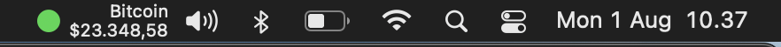
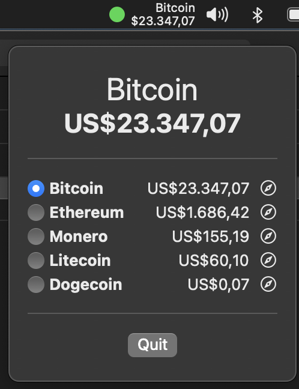

<!-- ABOUT THE PROJECT -->
<p align="center">
  <a href="#" target="_blank"></a>
</p>

# CrypTraces
Aplikasi CrypTraces adalah MacOS Widget Crypto Tracker dengan SwiftUI, Combine & Cocoa Framework, dan WebSocket & CoinCap API. Aplikasi ini berbentuk Widget di Menu Bar MacOS dengan menampilkan beberapa Crypto Currency seperti Bitcoin (BTC), Ethereum (ETH), Dogecoin (DOGE), Monero (XMR), dan Litecoin (LTC).

### Preview
<p align="center">
  <a href="#" target="_blank"></a>
</p>

<!-- ABOUT THE FILE & FOLDER STRUCTURE -->
## Folder & File Structure
Berikut struktur file dan folder pada CrypTraces:

    .
    ├── CrypTraces.swift                 # Root Project: Main App dengan Base Empty View di MacOS App
    ├── Info.plist                       # Network - Enable Internet Access in Xcode for macOS App
    ├── AppDelegate.swift                # Berisikan Fungsi App Launch Handler
    ├── APIService                       # APIService: Fungsi API Service
    │   └── CoinCapPriceService.swift    # Berisikan Fungsi API Connection, Network Monitoring, (Receive, Record, & Convert Data), Ping Scheduler
    │
    ├── Model                            # Model: Deklarasi Data Coin & CoinType
    │   ├── Coin.swift                   # Berisikan Deklarasi Data Representation dari Coincap & Websocket (name & value)
    │   └── CoinType.swift               # Berisikan Deklarasi Data Coin-coin Crypto Currency
    │
    ├── View                             # View: Tampilan Frontend Widget
    │   ├── MenuBarCoinView.swift        # Berisikan Tampilan Frontend Menu Bar Widget
    │   └── PopoverCoinView.swift        # Berisikan Tampilan Frontend Popup
    │
    └── ViewModel                        # ViewModel: Fungsi Realtime Update Data (Coin Prices)
        ├── MenuBarCoinViewModel.swift   # Berisikan Fungsi Update Data Coin Value (Prices) di Menu Bar dengan Combine Subscriber 
        └── PopoverCoinViewModel.swift   # Berisikan Fungsi Update Data Coin Value (Prices) di Popover dengan Combine Subscriber

<!-- List of Features -->
## Features:

* Realtime Crypto Currency Tracker
* Ping Scheduler
* CoinCap & WebSocket API
* Menu Bar MacOS Widget
* Cocoa & Combine Framework
* Network Monitoring (NWPathMonitor)

<!-- Used Tools -->
## Build With:

* [Swift](https://www.swift.org/documentation/)
* [SwiftUI](https://developer.apple.com/documentation/swiftui/)
* [Xcode](https://developer.apple.com/xcode/)
* [Combine Framework](https://developer.apple.com/documentation/combine)
* [Network Framework](https://developer.apple.com/documentation/network)
* [CoinCap & WebSocket API](https://docs.coincap.io/#37dcec0b-1f7b-4d98-b152-0217a6798058)

<!-- How to Install -->
## Installation
Untuk menggunakan repositori ini, ikutilah petunjuk penggunaan berikut dan pastikan git sudah terinstall pada komputer (semua perintah dilaksanakan pada `cmd.exe` atau `terminal`):

1. Lakukan download .zip atau `clone` repositori dengan cara:
```bash
git clone https://github.com/dekapd99/CrypTraces.git
```

2. Jika sudah silahkan buka Project di Xcode.
3. Pastikan hal ini: Buka info.plist dan cek Enable Internet Access in Xcode for macOS App: Klik Project CrypTraces > Signing & Capabilities > App Sandbox (Checklist Network: Outgoing Connections (client))
4. Build & Run

<!-- What Kind of License? -->
## License
MIT License: Copyright (c) 2022 DK

<p align="right">(<a href="#top">back to top</a>)</p>
